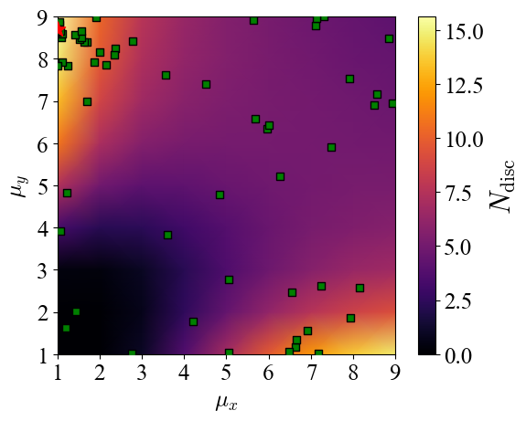

# light-by-light

This package provides helpful functions to run gridscan simulations and optuna optimizations using Vacuum Emission solver [1]. There are also routines to create corresponding bash scripts on Draco cluster. 

- usage.ipynb illustrates typical gridscan and optuna optimization scenario
- create_bash.ipynb shows the routines to create bash scripts for Draco

This package was used to obtain results for our paper [2].

## Example

Example optimization scenario is shown on the figure. Here we consider the collision of two optical laser beams, where one beam (pump) is focused to its diffraction limit (waist size $w_0 = \lambda_0$) while other beam (probe) has an elliptic cross section with two independent waist sizes ($w_{x,y} = \mu_{x,y} \lambda_0$). We are interested in maximizing the total discernible quantum vacuum signal. The colormap corresponds to simulations from a grid scan and green squares correspond to optimization trials. Even for two variable parameters the grid simulations require a lot of computational power which quickly becomes unfeasible for higher-dimensional parameter spaces. Bayesian optimization helps to explore these parameter spaces much more efficiently.

## Potential improvements -> implemented in new repo [light-by-light-botorch](https://github.com/maxbalrog/light-by-light-botorch)
1. Since it is not easy to get access to optuna surrogate model and posterior distribution of TPE sampler, we plan to switch to a more versatile Bayesian library: BoTorch and Ax.
2. With the help of high-level schedulers it might be possible to make more efficient and better structured implementation of grid scans and optimizations.

## Resources
[1] - A. Blinne, et al. "All-optical signatures of quantum vacuum nonlinearities in generic laser fields." Physical Review D 99.1 (2019): 016006.

[2] - M. Valialshchikov, et al. [Numerical optimization of quantum vacuum signals](https://arxiv.org/abs/2405.03317) arxiv:2405.03317
